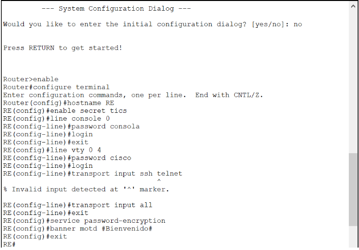
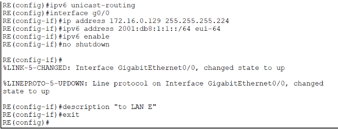
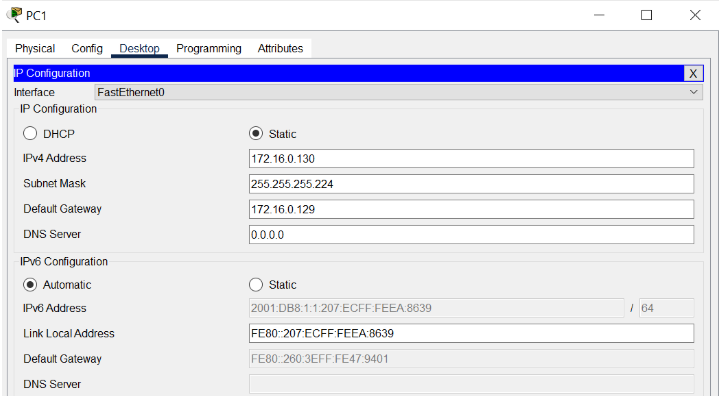
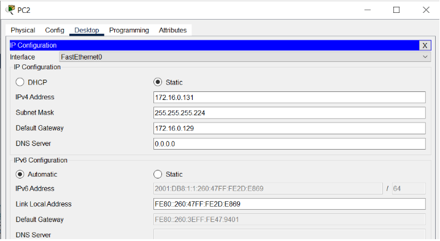
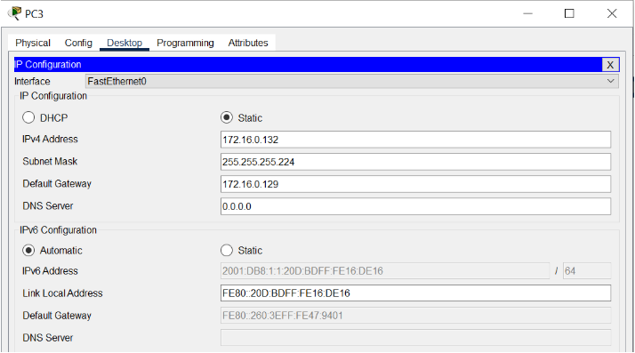
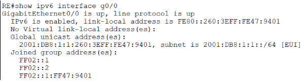
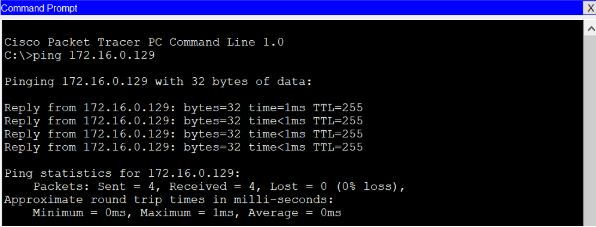
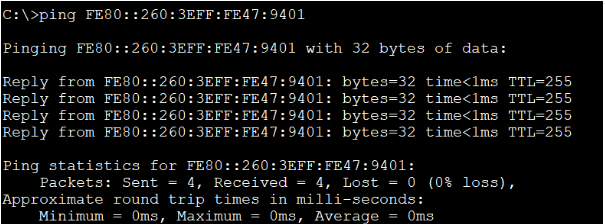
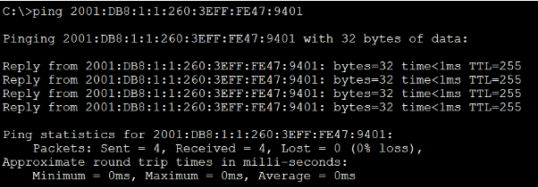

# Fundamentos-Redes-Integrador
Este repositorio está destinado a documentar los pasos que usaremos en el proyecto integrador en la materia de Fundamentos de Redes. Contiene una guía, configuraciones y recursos útiles para facilitar el desarrollo y comprensión del proyecto.

# Configuración del switch 
| Ip                             | Dispositivo                        | Ip sugerida                                                                 |
|--------------------------------|------------------------------------|------------------------------------------------------------------------------|
| 172.16.0.128 ID                | Router (RE)                        | 172.16.0.129  (Esta IP es nuestro GATEWAY)                                  |
| 172.16.0.158 BR                | Switch (SE)                        | 172.16.0.158 (Administración (última IP útil))                              |
| 255.255.255.224 Mask           | PC1                                | 172.16.0.130                                                                 |
|                                | PC2                                | 172.16.0.131                                                                 |
|                                | PC3                                | 172.16.0.132                                                                 |
|                                |                                    | **NOTA:** A partir de la IP con terminación .130 podemos asignar dispositivos hasta la .157 |

## Configurar Switch

1. Seleccionar la PC y el Switch para hacer la conexión.
   (agregar imagenes)

### Pasos para configurar:
1. Configurar `hostname` y `banner`
2. Configurar `password` y `secret`
3. Colocar contraseña a la consola
4. Colocar contraseña a la conexión Telnet
5. Configurar VLAN
6. Configurar SSH

## Configuraciones en el Router


### Configuración básica

| Acción                                | Comando                             |
|--------------------------------------|-------------------------------------|
| Acceso al modo privilegiado          | `enable`                            |
| Modo configuración global            | `configure terminal`                |
| Asignar nombre al router             | `hostname RE`                       |
| Cifrado de contraseñas               | `service password-encryption`       |
| Mensaje de bienvenida                | `banner motd #Bienvenido#`          |

### Configurar consola

```bash
line console 0
password consola
login
exit
```

### Configurar acceso remoto (VTY 0–4)

```bash
line vty 0 4
password cisco
login
transport input all
exit
```
`Nota: El comando transport input ssh telnet puede no funcionar en versiones antiguas del IOS. Usar transport input all`



### Configuración de interfaces (IPv4 / IPv6)

**Parámetros:**
- IP y Máscara: `172.16.0.128 / 27` → `255.255.255.224`
- Rango IPs útiles: `172.16.0.129` a `172.16.0.157`
- Prefijo IPv6 Global: `2001:db8:1:1::/64`
- IPv6 link-local: Automática

| Acción                                  | Comando                                                     |
|----------------------------------------|-------------------------------------------------------------|
| Habilitar enrutamiento IPv6            | `ipv6 unicast-routing`                                     |
| Acceder a la interfaz g0/0             | `interface g0/0`                                           |
| Asignar dirección IPv4 y máscara       | `ip address 172.16.0.129 255.255.255.224`                  |
| Asignar dirección IPv6 con EUI-64      | `ipv6 address 2001:db8:1:1::/64 eui-64`                     |
| Activar IPv6 link-local automática     | `ipv6 enable`                                              |
| Añadir descripción a la interfaz       | `description "to LAN E"`                                   |
| Activar la interfaz                    | `no shutdown`                                              |
| Salir de la configuración de interfaz  | `exit`                                                     |



### Configuración de los dispositivos finales (host)







### Ping entre las interfaces 

1. Hacer ping desde PC1, PC2 y PC3 a:

- Dirección IPv4 del router: 172.16.0.129

- Dirección link-local IPv6 del router: FE80::260:3EFF:FE47:9401

- Dirección global IPv6 del router: 2001:DB8:1:1:260:3EFF:FE47:9401

2. Verificar IPv6 con el comando:

```bash
show ipv6 interface g0/0
```
`Este comando muestra información detallada de la configuración IPv6 de la interfaz especificada, 
en este caso GigabitEthernet0/0.
`



3. Resultados

- Ping a la dirección IPv4 del router 

  

- Ping a la dirección link-local IPv6 del router 
  
  

- Ping a la dirección global IPv6 del router 

  


