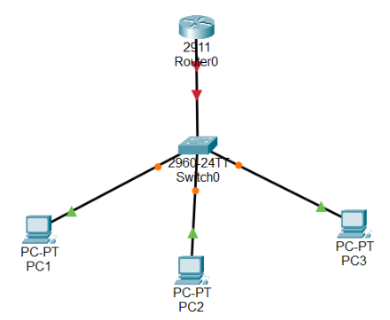

# Fundamentos-Redes-Integrador
Este repositorio está destinado a documentar los pasos que usaremos en el proyecto integrador en la materia de Fundamentos de Redes. Contiene una guía, configuraciones y recursos útiles para facilitar el desarrollo y comprensión del proyecto.

# Configuración del switch 
| Ip                             | Dispositivo                        | Ip sugerida                                                                 |
|--------------------------------|------------------------------------|------------------------------------------------------------------------------|
| 172.16.0.128 ID                | Router (RE)                        | 172.16.0.129  (Esta IP es nuestro GATEWAY)                                  |
| 172.16.0.158 BR                | Switch (SE)                        | 172.16.0.158 (Administración (última IP útil))                              |
| 255.255.255.224 Mask           | PC1                                | 172.16.0.130                                                                 |
|                                | PC2                                | 172.16.0.131                                                                 |
|                                | PC3                                | 172.16.0.132                                                                 |
|                                |                                    | **NOTA:** A partir de la IP con terminación .130 podemos asignar dispositivos hasta la .157 |

## Configurar Switch

1. Seleccionar la PC y el Switch para hacer la conexión.
   (agregar imagenes)

### Pasos para configurar:
1. Configurar `hostname` y `banner`
2. Configurar `password` y `secret`
3. Colocar contraseña a la consola
4. Colocar contraseña a la conexión Telnet
5. Configurar VLAN
6. Configurar SSH

## Configuraciones en el Router



### Configuración básica

| Acción                                | Comando                             |
|--------------------------------------|-------------------------------------|
| Acceso al modo privilegiado          | `enable`                            |
| Modo configuración global            | `configure terminal`                |
| Asignar nombre al router             | `hostname RE`                       |
| Cifrado de contraseñas               | `service password-encryption`       |
| Mensaje de bienvenida                | `banner motd #Bienvenido#`          |

### Configurar consola

```bash
line console 0
password consola
login
exit
```

### Configurar acceso remoto (VTY 0–4)

```bash

